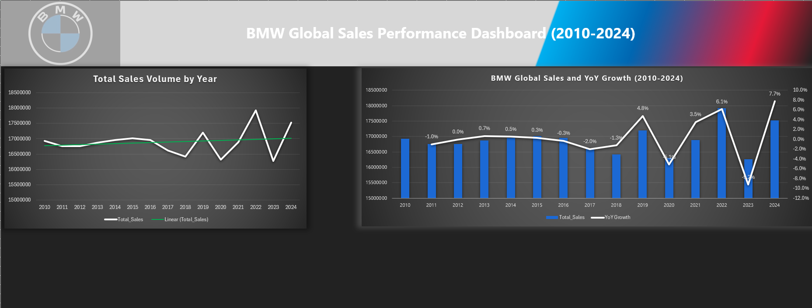

# Excel Dashboard Portfolio

A collection of interactive Excel dashboards analyzing real-world datasets.  
Each project focuses on a unique topic and demonstrates data cleaning, visualization, and storytelling.

##  Projects

| Project | Description | Preview |
|----------|--------------|----------|
| [BMW Sales Performance](BMW_Sales_Dashboard.xlsx) | Analyzes BMW Global Sales 2010-2024 by year, region, YoY Growth and by Model. |  |
| (coming soon) | ... | ... |

## Tools Used
- Microsoft Excel (Power Query, PivotTables, Slicers, Conditional Formatting)
- GitHub for version control & sharing

## About
Created by Lincoln Koskela — I’ve been experimenting with spreadsheets for over five years, tracking everything from my Honda Civic and Kawasaki Z500 to work, rent, expenses, and subscriptions. If it can be measured, I’ve probably logged it. I love transforming everyday data into visual insights that tell a story.
I’m currently an IT and Data Analytics student passionate about data visualization, Excel automation, and interactive dashboards. This portfolio is my creative space to keep building and sharing projects as I continue learning and improving.
